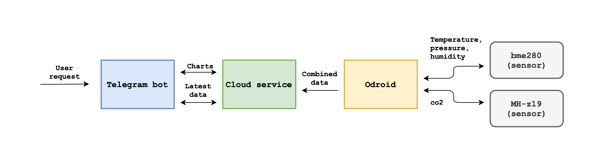

# co2esp32tg

This is a remote termometer which uses a telegram bot as an interface. So, I can find out it's time to open a window using the most popular messenger in Russia.

## Details

There are two systemd-services, one is launched on odroid device and sends sensors readings to the second one, which is launched in a cloud (I used a digitalocean virtual machine). The web application takes the data, collects it into database and expects for requests from telegram bot. There are two main requests available now: the last sensors readings and charts with historical data.

Two sensors, MH-z19 (co2) and bme280 (humidity, pressure, temperature), are connected to an odroid device where a simple python script tries to send data to specified urls.

## Usage

You might want to launch your own bot implementation, so follow the steps:
1) Buy odroid (or raspberry) device, MH-z19 and bme280 sensors. Fill servicemd template and enable service.
2) Create a virtual machine with public IP, fill `server` systemd confing (ssl-sertificates, working directory, etc), and enable it.
3) Create a new telegram bot and set web hook for your virtual host.
